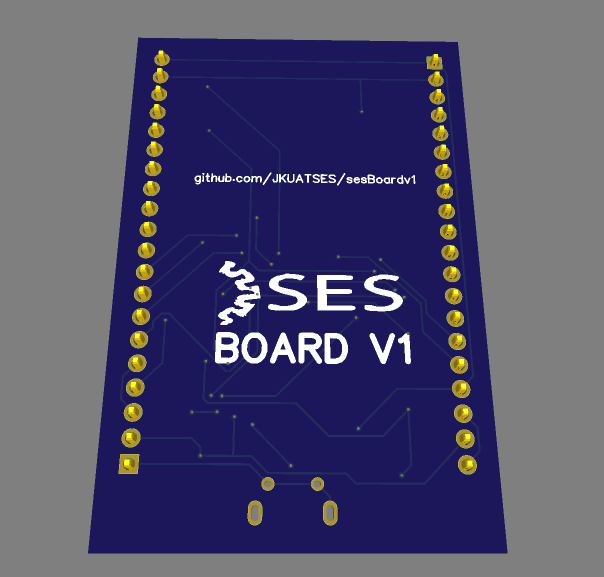
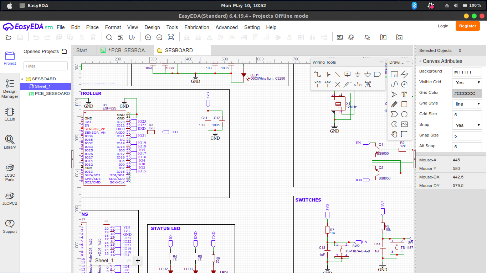

# sesBoardv1

[](https://github.com/JKUATSES/sesBoardv1/issues)


[](https://github.com/JKUATSES/sesBoardv1/blob/master/LICENSE)

Welcome to the JKUAT SES Board repository for management and storage of SESBOARD v1. Additional information about the team and current projects can be found [JKUAT SES website](https://ses.jkuat.ac.ke).

If you are a new member of the team and have never used [git version control](http://git-scm.com/) before, we highly recommend that you familiarize yourself with it by reading [this guide](https://github.com/RoboJackets/robocup-firmware/blob/master/doc/Git.md).

## How it will look

### Top


### Bottom



## Prerequisites

* A computer configured with [git](https://desktop.github.com/)
* An installation of [EasyEDA](https://docs.easyeda.com/en/FAQ/Download/#Desktop-Client) and its [Local router](https://docs.easyeda.com/en/FAQ/Download/#Local-Auto-Router-Server)

## Setup EasyEda

01. Downloading the files

Once your computer is set up with git, the following lines can be used on any operating system within a terminal configured with git. Users who are using a GUI interface for git should simply add the respective repositories through the interface.

``` sh
# Download the initial files
git clone https://github.com/JKUATSES/sesBoardv1

# Go into our new directory
cd sesBoardv1

```

02. Open the [Schematic file](Design/SESBOARD.json) and [PCB file](Design/PCB_SESBOARD.json) in EasyEda




## Board Design

### 1. Micro-USB connector


#### Pin configuration

01. Vcc (+5V) +5V DC voltage

02. D- Data -

03. D+ Data +

04. ID Mode detect

05. Gnd Ground

#### Specifications

01. Micro USB – Type B/SMT

02. Gender: Female

03. Number of Pins: 5

04. Mating cycle: More than 5000 times

05. Current rating: 1A

06. Voltage Rating: 30V (max)

#### Use

The micro USB connector can be used to power or communicate with devices. The micro USB Jack has five pins through which the power and data are transferred, the 4th pin ID is used for mode detection, this indicates if the USB is used only for power or for data transfer. The D+ and the D- pins should be connected to the D+ and D- pins of the host respectively. They also require a pull-down resistor of value 15K each for the data to transfer. 

### 2. Voltage regulator


#### Pin configuration

01. Adjust/Ground - This pin adjust the output voltage, if it is a fixed voltage regulator it acts as ground

02. Output Voltage (Vout) - The regulated output voltage set by the adjusted pin can be obtained from this pin

03. Input Voltage (Vin) - The input voltage which has to be regulated is given to this pin

#### Specifications

01. Low Drop-Out (LDO) Voltage regulator
02. Fixed Voltage type: 1.5V, 1.8V, 2.5V, 2.85V, 3.3V and 5V
03. Output current is 1000mA
04. Maximum Drop-out Voltage: 1.3V
05. In-built Current Limiting and thermal protection.

#### Use

Using the AMS1117 is pretty much straight forward. If it a fixed voltage regulator just power the IC through the Vin pin and the regulated output can be obtained in the Vout pin. The Adj/Ground pin in this case acts only as a ground pin and is grounded. Also, a capacitor can be added at the input and output side to filter out the noise. In this case, I added a bulk capacitor of `10uF` near the source to act as a reservoir of charge. The local decoupling capacitor of `100nF` is near the load to filter out noise. I also added a power LED in parallel to indicate if the board is on or off.

### 3. USB to TTL module


#### Pin configuration

01. 16 VCC POWER Positive power input port, requires an external 0.1uF power decoupling capacitance
02. 1 GND POWER Public ground, ground connection for USB
03. 4 V3 POWER connects of VCC to input outside power while 3.3V connects of 0.01uF decoupling capacitance outside while 5V
04. 7 XI IN Input of crystal oscillator, attachment of crystal and crystal oscillator capacitance outside
05. 8 XO OUT Opposite output of crystal oscillator, attachment of

crystal and crystal oscillator capacitance outside

06. 5 UD+ USB signal Directly connect to D+ data wire of USB bus, set up

pull-up resistor internal

07. 6 UD- USB signal Directly connect to D- data wire of USB bus
08. 2 TXD OUT Serial data output(opposite phasic output of CH340G)
09. 3 RXD IN Serial data input, set up controlled pull-up and

pull-down resistor

10. 9 CTS# IN MODEM liaison input signal, clear sending, active with

low(high)

11. 10 DSR# IN MODEM liaison input signal, data equipment is ready,

active with low(high)

12. 11 RI# IN
13. 12 DCD# OUT MODEM liaison input signal, carrier wave detection,

active with low(high)

14. 13 DTR# OUT MODEM liaison output signal, data endpoint is ready,

active with low(high)

15. 14 RTS# OUT MODEM liaison output signal, request to send, active

with low(high)

16. 15 R232 IN Assistant RS232 enable, active with high, set up

pull-down resistor internal

#### Specifications

01. Full speed USB device interface conforms to USB Specification Version 2.0, only needs crystal and capacitance external.
02. Hardware full duplex serial interface, set transceiver buffer, supports communication baud rate varies from 50bps to 2Mbps.
03. Supports common MODEM liaison signal RTS, DTR, DCD, RI, DSR and CTS.
04. Supports IrDA criterion SIR infrared communication, supports baud rate varies from 2400bps to 115200bps.
05. Support 5V and 3.3V source voltage.

#### Use

CH340G chip set up USB pull-up resistor internal, UD+ and UD- pins must be connected to USB bus directly. CH340 chip set up power-up reset circuit internally. When the CH340 chip is working normally, the outside must supply a 12MHz clock signal to the XI pin. In general, a clock signal is generated by an inverter in CH340 through oscillating of crystal keeping frequency. A crystal of 12MHz between XI and XO, XI and XO connect a high-frequency oscillator capacitance to ground respectively can compose the peripheral circuit. CH340 chip supports 5V and 3.3V power voltage. When using 5V source power, the VCC input 5V power and the pin of V3 must connect with 4700pF or 0.01uF decoupling capacitance. When using 3.3V power voltage, connects V3 with VCC, and input 3.3V power voltage. And the other circuit voltage which is connected with CH340 is no more than 3.3V. CH340 automatically supports a USB device suspending to save power consumption. NOS# is low–level can forbid USB device suspending. In asynchronous serial interface mode, the CH340 chip contains these pins: data transfer pin, MODEM liaison signal pin and assistant pin. The data transfer pin contains the TXD pin and RXD pin. When the serial interface is idle, RXD must be high-level. If R232 is high-level, use the assistant RS232 function, then the RXD pin automatically inserts an inverter
internal, and low-level is in default. When serial interface output is free, the TXD in CH340H and CH340T is high level, TXD in CH340R is low-level. MODEM liaison signal pin contains: CTS#, DSR#, RI#, DCD# and RTS#. All these MODEM liaison signal are controlled by a computer application program and the application program defines function. 

### 4. Status LEDs


#### Pin configuration

01. VCC - where the voltage is applied
02. GND - connected to the ground terminal

#### Specifications

01. Package: 0805
02. Emitting colours: Blue or cool white
03. Forward Current (IF): 20mA
04. Forward Voltage (VF): 2.9V
05. Power Dissipation:68mW
06. Operating and Storage Temperature: -40 to 100°C

#### Use

The resistor used is based on this formula `R = (Vs - Vf)/If` where R is the resistor of the led in series, Vs is the source voltage, 3.3v, Vf is the forward voltage of the resistor, 3v and If is the desired forward current passing through the led, 20mA. Using this [online led calculator](https://www.digikey.com/en/resources/conversion-calculators/conversion-calculator-led-series-resistor) we got the expected resistor values of 15.

### 5. Switches


#### Use

Switch debouncing is one of those things you generally have to live with when playing with switches and digital circuits. If you want to input a manual switch signal into a digital circuit you'll need to debounce the signal so a single press doesn't appear like multiple presses. The basic idea is to use a capacitor to filter out any quick changes in the switch signal. Starting with the switch open.

* The capacitor C13 will charge via R7.
* In time, C1 will charge
* Therefore the output of the inverting Schmitt trigger will be a logic 0.

Now close the switch

* The capacitor will discharge via R7.
* In time, C1 will discharge.
* Therefore the output of the inverting Schmitt trigger will be a logic 1.

But what about bounce conditions? If bounce occurs and there are short periods of switch closure or opening, the capacitor will stop the voltage at Vb immediately reaching Vcc or GND. Although, bouncing will cause slight charging and discharging of the capacitor, the hysteresis of the Schmitt trigger input will stop the output from switching.

### 6. Microcontroller unit


#### Pin configuration

Check out the [schematics](https://www.espressif.com/sites/default/files/documentation/esp32-wroom-32_datasheet_en.pdf) for more information.

#### Specifications

Check out the [schematics](https://www.espressif.com/sites/default/files/documentation/esp32-wroom-32_datasheet_en.pdf) for more information.

## References

01. https://randomnerdtutorials.com/esp32-pinout-reference-gpios/
02. https://i0.wp.com/randomnerdtutorials.com/wp-content/uploads/2018/08/esp32-pinout-chip-ESP-WROOM-32.png?resize=1024%2C523&quality=100&strip=all&ssl=1
03. https://robu.in/wp-content/uploads/2019/03/Schematic-WeMos-LOLIN32-V1.0.0-based-on-ESP32-Rev1-Wifi-Bluetooth-Board-ROBU.IN_.pdf
04. https://www.mpja.com/download/35227cpdata.pdf
05. https://pbs.twimg.com/media/Cu75DCQVYAE1R5A.jpg
06. https://www.espressif.com/sites/default/files/documentation/esp32-wroom-32_datasheet_en.pdf
07. https://www.digikey.com/en/resources/conversion-calculators/conversion-calculator-led-series-resistor
08. https://github.com/nodemcu/nodemcu-devkit-v1.0/blob/master/NODEMCU_DEVKIT_V1.0.PDF
09. https://circuitdigest.com/microcontroller-projects/design-your-own-esp-modules-for-battery-powered-iot-applications
10. https://stm32-base.org/boards/STM32F103C8T6-Blue-Pill.html
11. https://jlcpcb.com/capabilities/Capabilities
12. https://jlcpcb.com/parts/componentSearch?isSearch=true&searchTxt=TP4054

## Sponsor Thank You!

01. [JLCPCB](http://jlcpcb.com/) - donation of PCB fabrication runs
02. [Jeff Mboya](https://twitter.com/AnginaMboya) - donation of SMT assembly funds

## Contributing

Please read [CONTRIBUTING.md](https://gist.github.com/PurpleBooth/b24679402957c63ec426) for details on our code of conduct, and the process for submitting pull requests to us.

## License

This project is licensed under the MIT License - see the [LICENSE.md](https://github.com/JKUATSES/sesBoardv1/blob/main/LICENSE) file for details
